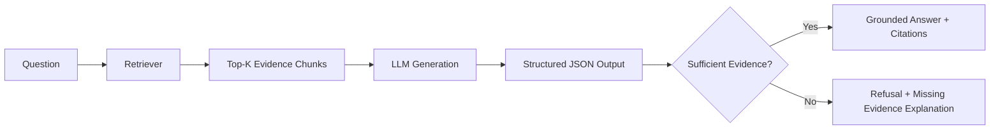
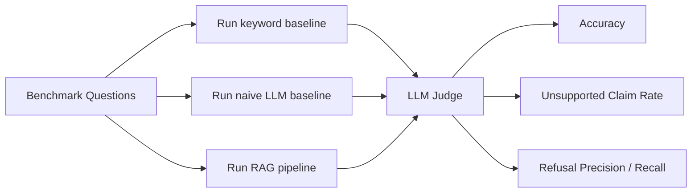

# Hallucination-Controlled RAG — Grounded LLM Evaluation System

A retrieval-augmented generation system for studying how citation grounding, structured outputs, and refusal policies reduce unsupported LLM claims.

## Overview
This repository packages a complete RAG experiment around a simple but important question: how do you make an LLM answer only when it has evidence, and refuse when it does not?

The system ingests a local document corpus, retrieves relevant evidence with TF-IDF search, generates structured JSON answers with citations, and evaluates three methods side by side:

- `keyword`: retrieve a single matching chunk and answer from it
- `naive_gpt`: answer directly with no retrieval constraint
- `rag`: retrieve evidence, require citation-grounded output, and refuse when evidence is insufficient

The project is designed to emphasize reliability and evaluation rather than chatbot polish. It includes dataset generation, local indexing, structured output enforcement, a comparison harness, and a scoring pipeline for correctness, unsupported claims, and refusal behavior.

## Why This Matters
LLMs frequently produce fluent but unsupported statements. That failure mode is unacceptable in systems where answers need to be evidence-backed.

This repository focuses on that problem directly:

- retrieve relevant context before generation
- constrain answers into a fixed JSON schema
- attach source-backed citations
- refuse when the available evidence is not strong enough
- measure the resulting behavior against weaker baselines

## Problem
A plain LLM can answer any question, including questions it cannot actually support from the available documents. In practice, that means:

- unsupported claims
- false confidence
- poor behavior on unanswerable questions
- inconsistent output structure for downstream systems

## Solution
This system implements a hallucination-controlled RAG pipeline with three safeguards:

1. Retrieval: answers are conditioned on retrieved corpus evidence rather than the prompt alone.  
2. Structured outputs: generation and grading both use JSON-schema-constrained outputs.  
3. Refusal logic: when retrieval confidence is insufficient, the model is expected to refuse and state what evidence is missing.

## Key Features
- Retrieval-augmented generation over a local lightweight vector store
- Citation-grounded answer format with `final_answer`, `cited_chunks`, and `refused`
- Refusal behavior for insufficient evidence
- Structured JSON outputs via the OpenAI Responses API
- Baseline comparison framework (`keyword`, `naive_gpt`, `rag`)
- Evaluation pipeline for correctness, unsupported claims, refusal precision, and refusal recall
- Reproducible synthetic corpus and 60-question benchmark
- Local web interface and CLI for querying the system

## System Design
The end-to-end flow is:

`query -> retrieval -> evidence packaging -> generation -> schema validation -> output -> grading`

### Pipeline


### Evaluation Flow


## Architecture
### Retrieval Layer
- Corpus chunking from local Markdown/text documents
- TF-IDF vectorization with cosine similarity ranking
- Top-k evidence chunk retrieval with line-based offsets

### Generation Layer
- OpenAI Responses API for answer generation
- Structured JSON output schema for answer format enforcement
- Three answer modes: keyword baseline, naive LLM baseline, and RAG

### Validation / Constraint Layer
- Answer schema requires:
  - `final_answer`
  - `cited_chunks`
  - `refused`
- Refusal path activates when no retrieved chunk exceeds the configured evidence threshold

### Evaluation Layer
- Separate LLM judge with structured grading schema
- Per-method scoring for:
  - answer correctness on answerable questions
  - unsupported claim rate
  - refusal precision
  - refusal recall
  - latency
  - estimated API cost

## Repository Layout
```text
.
|-- app.py
|-- make_dataset.py
|-- run_experiment.py
|-- evaluate.py
|-- rag_cli.py
|-- src/
|   |-- llm.py
|   |-- pipeline.py
|   |-- schemas.py
|   `-- vector_store.py
|-- data/
|   |-- *.md
|   |-- questions.jsonl
|   `-- vector_store/
|-- results/
|   |-- results.csv
|   |-- report.md
|   `-- *.png
|-- docs/
|   |-- architecture.md
|   |-- evaluation.md
|   `-- retrieval.md
`-- examples/
    |-- queries/
    `-- outputs/
```

## Tech Stack
- Python
- FastAPI
- OpenAI Responses API
- scikit-learn
- pandas
- matplotlib
- jsonschema
- pytest
- joblib

## Setup
### 1. Install dependencies
```bash
python -m pip install -r requirements.txt
```

### 2. Configure environment
Copy `.env.example` to `.env` and set:

```env
OPENAI_API_KEY=your_key_here
OPENAI_MODEL=gpt-4.1-mini
USE_MOCK_LLM=0
```

Notes:
- `USE_MOCK_LLM=1` runs the system in deterministic local mock mode.
- Mock mode is useful for local development and tests, but not for evaluating real grounded generation quality.

## How To Run
### Generate the dataset
```bash
python make_dataset.py
```

### Run the experiment
```bash
python run_experiment.py
```

### Evaluate and write the report
```bash
python evaluate.py
```

### Makefile shortcuts
```bash
make setup
make experiment
make report
```

## Running the System
### CLI
Build the vector store:
```bash
python rag_cli.py ingest --data_dir data --store_dir data/vector_store
```

Ask a question with the RAG pipeline:
```bash
python rag_cli.py answer --method rag --question "What is the default admin IP for the AX-200 router?"
```

Run evaluation:
```bash
python rag_cli.py evaluate --results results/results.csv
```

### Web UI
```bash
python app.py
```

Then open `http://127.0.0.1:3000`.

The web interface supports:
- interactive querying
- baseline switching
- document upload for local corpus replacement
- citation inspection

## Evaluation Framework
The benchmark contains 60 questions total:

- 40 answerable questions supported by the corpus
- 20 unanswerable questions with no supporting evidence in the corpus

Each method is evaluated against the same benchmark.

### Baselines
- `keyword`: constrained retrieval-first baseline using one top chunk
- `naive_gpt`: no retrieval grounding
- `rag`: retrieval + citation grounding + refusal logic

### Metrics
- `accuracy_on_answerable`
- `unsupported_claim_rate`
- `refusal_precision`
- `refusal_recall`
- `avg_cost_usd`
- `avg_latency_ms`

More detail is in [docs/evaluation.md](/c:/Users/ANISH%20PC/Desktop/RAG/rag-hallucination-study/docs/evaluation.md).

## Results
This repository includes the evaluation pipeline and generated artifacts in `results/`.

Important caveat:
- checked-in artifacts may reflect local mock-mode runs unless the experiment was executed with a live API-backed model
- the strongest claims about hallucination reduction should be based on live-model runs, not deterministic mock mode

What the repository supports today:
- reproducible generation of results CSVs
- automated report generation with plots
- structured comparison across all three methods

See:
- [results/report.md](/c:/Users/ANISH%20PC/Desktop/RAG/rag-hallucination-study/results/report.md)
- [results/results.csv](/c:/Users/ANISH%20PC/Desktop/RAG/rag-hallucination-study/results/results.csv)

## Example Outputs
### Grounded answer with citations
See:
- [examples/queries/grounded_query.md](/c:/Users/ANISH%20PC/Desktop/RAG/rag-hallucination-study/examples/queries/grounded_query.md)
- [examples/outputs/grounded_rag_answer.json](/c:/Users/ANISH%20PC/Desktop/RAG/rag-hallucination-study/examples/outputs/grounded_rag_answer.json)

### Refusal when evidence is insufficient
See:
- [examples/queries/refusal_query.md](/c:/Users/ANISH%20PC/Desktop/RAG/rag-hallucination-study/examples/queries/refusal_query.md)
- [examples/outputs/refusal_rag_answer.json](/c:/Users/ANISH%20PC/Desktop/RAG/rag-hallucination-study/examples/outputs/refusal_rag_answer.json)

### Naive hallucination vs corrected RAG behavior
See:
- [examples/outputs/naive_vs_rag_comparison.md](/c:/Users/ANISH%20PC/Desktop/RAG/rag-hallucination-study/examples/outputs/naive_vs_rag_comparison.md)

## Engineering Decisions
### Why RAG?
Because answer quality alone is not enough; the system needs a path from answer to evidence.

### Why structured outputs?
Unstructured generations are harder to validate and integrate. JSON schema enforcement makes the answer contract explicit and machine-checkable.

### Why refusal?
A high-quality retrieval system still encounters unsupported questions. Refusing in those cases is a reliability feature, not a failure.

### Why evaluation-driven development?
Without a benchmark and explicit metrics, it is easy to overestimate groundedness. The evaluation harness makes unsupported-claim behavior measurable.

## Tests
Current tests focus on safe reliability checks:
- JSON schema validity
- refusal behavior under insufficient evidence

Run:
```bash
pytest
```

## Additional Docs
- [Architecture](/c:/Users/ANISH%20PC/Desktop/RAG/rag-hallucination-study/docs/architecture.md)
- [Evaluation](/c:/Users/ANISH%20PC/Desktop/RAG/rag-hallucination-study/docs/evaluation.md)
- [Retrieval](/c:/Users/ANISH%20PC/Desktop/RAG/rag-hallucination-study/docs/retrieval.md)

## Future Improvements
- swap TF-IDF retrieval for dense embeddings or hybrid retrieval
- add citation validation against retrieved spans
- add calibration studies for refusal thresholds
- version datasets and experiment configs more formally
- export a cleaner benchmark bundle for repeated live-model evaluation

## Recruiter Summary
This repository demonstrates practical LLM systems work beyond prompt wrapping:

- retrieval-backed generation
- schema-constrained model I/O
- refusal-aware reliability design
- baseline benchmarking
- measurable hallucination control
- local reproducibility and testing
