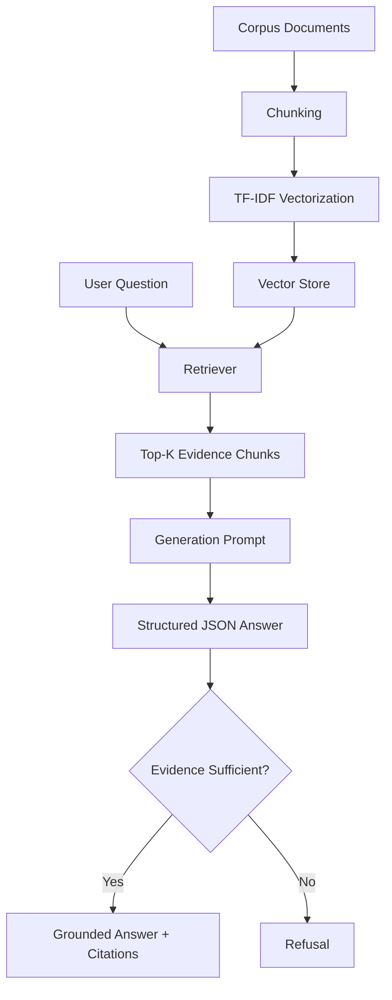

# Architecture

## Intent
This repository is organized around a simple reliability goal: produce answers that are grounded in retrieved evidence and refuse when grounding is not available.

The implementation is intentionally lightweight:

- local corpus files in `data/`
- TF-IDF retrieval in [`src/vector_store.py`](/c:/Users/ANISH%20PC/Desktop/RAG/rag-hallucination-study/src/vector_store.py)
- generation and grading through the OpenAI Responses API in [`src/llm.py`](/c:/Users/ANISH%20PC/Desktop/RAG/rag-hallucination-study/src/llm.py)
- orchestration logic in [`src/pipeline.py`](/c:/Users/ANISH%20PC/Desktop/RAG/rag-hallucination-study/src/pipeline.py)
- experiment runner in [`run_experiment.py`](/c:/Users/ANISH%20PC/Desktop/RAG/rag-hallucination-study/run_experiment.py)
- evaluator in [`evaluate.py`](/c:/Users/ANISH%20PC/Desktop/RAG/rag-hallucination-study/evaluate.py)

## End-to-End Flow

## Runtime Components

### 1. Retrieval
The retrieval layer builds a local index over chunked documents. Chunks are separated by blank lines and stored with line offsets so the final answer can point back to the original source span.

### 2. Generation
Three generation paths are supported:

- `keyword_baseline`
- `naive_gpt_baseline`
- `rag_with_refusal`

The RAG path is the reliability-focused path. It retrieves top-k evidence chunks, packages them into the prompt, and expects a schema-constrained JSON response.

### 3. Structured Output Enforcement
Answers are constrained to a schema with:

- `final_answer`
- `cited_chunks`
- `refused`

That makes the model contract explicit and allows downstream validation and consistent evaluation.

### 4. Refusal Control
The RAG pipeline checks whether any retrieved chunk exceeds a minimum retrieval score threshold. If not, the model is prompted to refuse and explain that supporting evidence is missing.

### 5. Evaluation
The evaluator runs all methods on the benchmark, then uses a structured LLM judge to assess:

- correctness
- unsupported claims
- refusal appropriateness

Those row-level judgments are aggregated into the final metrics table.

## Why This Architecture Is Useful
This system is not trying to be a production search stack. It is trying to make reliability behavior inspectable.

That is why the architecture favors:

- local reproducibility
- explicit schemas
- visible citations
- measurable refusal behavior
- side-by-side baseline comparison

## Important Limitation
This repository includes both live-model mode and deterministic mock mode. Mock mode is useful for smoke testing and local development, but it should not be treated as evidence of real grounded-generation performance.
