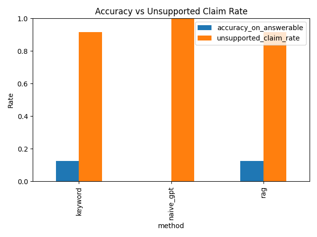
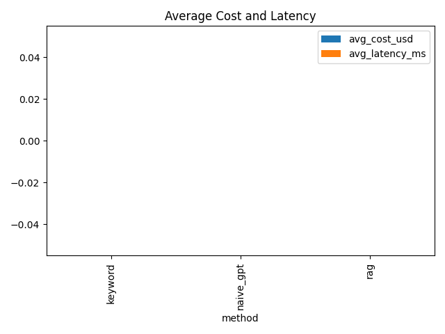

# RAG Hallucination Study Report

## Summary Metrics

| method    |   accuracy_on_answerable |   unsupported_claim_rate |   refusal_precision |   refusal_recall |   avg_cost_usd |   avg_latency_ms |
|:----------|-------------------------:|-------------------------:|--------------------:|-----------------:|---------------:|-----------------:|
| keyword   |                    0.125 |                    0.917 |                   0 |                0 |              0 |                0 |
| naive_gpt |                    0     |                    1     |                   0 |                0 |              0 |                0 |
| rag       |                    0.125 |                    0.917 |                   0 |                0 |              0 |                0 |

## Plots

